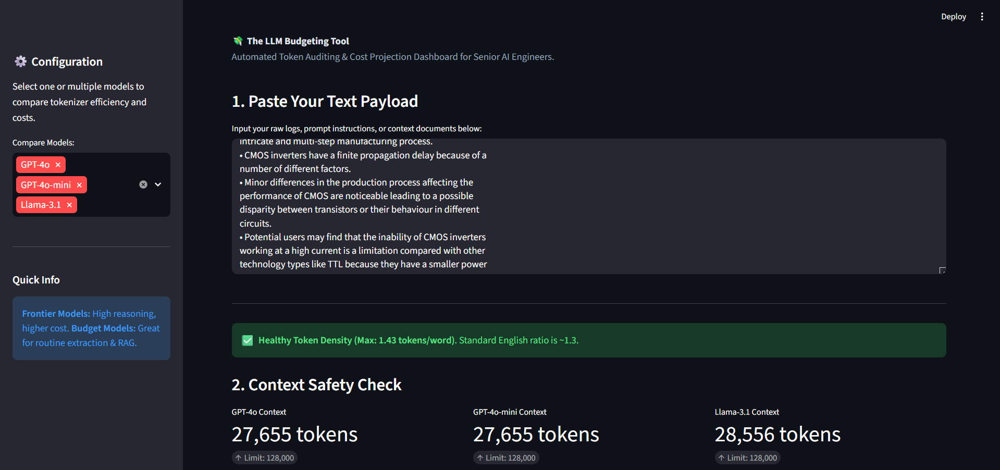
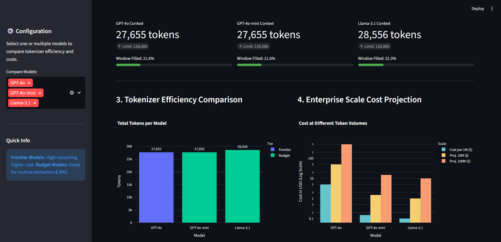
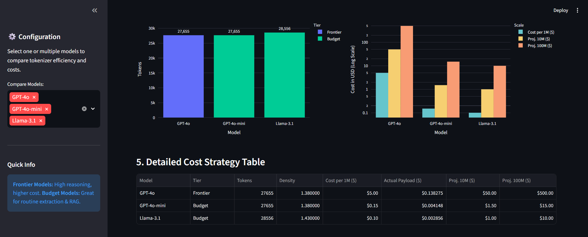

# 💸 The LLM Budgeting Tool

A production-grade web dashboard designed for **Senior AI Engineers** to audit token usage, monitor context safety, and simulate multi-model cost strategies before deploying large-scale LLM pipelines.

---

## 🎯 Project Objective
In the transition from prompt engineering to AI Engineering, managing costs and context windows is critical. This tool provides an empirical way to:
*   **Audit Token Usage:** Compare how different tokenizers (OpenAI's `cl100k_base` vs. Llama 3) handle identical payloads.
*   **Context Safety Check:** Visualize context window saturation to prevent "silent truncation" in RAG pipelines.
*   **Cost Projection:** Calculate precise expenditures for 1M, 10M, and 100M tokens across multiple model tiers.
*   **Token Density Analysis:** Detect "noisy" text (code/JSON) that causes unexpected cost spikes.

---

## 🚀 Core Features

### 1. Multi-Model Tokenization Audit
Compare token counts across **Frontier** (GPT-4o, o1), **Budget** (GPT-4o-mini, Llama 3.1, DeepSeek-V3), and **Legacy** models. 



### 2. Context Window Visualization
A real-time safety indicator shows exactly how much of a model's context window (e.g., 128k) is consumed by the current payload, helping engineers optimize prompt length.



### 3. Enterprise Cost Projection
Go beyond "cost per call" and visualize scalability. The tool projects costs at enterprise scales (up to 100M tokens) using logarithmic scales for better readability across disparate price points.



### 4. Token Density Analysis
Automatically calculates the **Tokens-per-Word** ratio. 
*   **Standard English:** ~1.3 tokens/word.
*   **High Density (>1.5):** Warns the user when text is likely code, logs, or dense JSON, which will be significantly more expensive.

---

## 🛠️ Technical Stack
*   **Frontend:** [Streamlit](https://streamlit.io/) for the interactive dashboard.
*   **Data Processing:** [Pandas](https://pandas.pydata.org/) for cost modeling and data transformation.
*   **Visualization:** [Plotly](https://plotly.com/) for dynamic, grouped bar charts and context progress indicators.
*   **Tokenization Engine:** 
    *   `tiktoken`: Powering OpenAI's `o200k_base` and `cl100k_base`.
    *   `HuggingFace Transformers`: Powering Llama-3 and DeepSeek tokenizers.

---

## 📦 Installation & Setup

1. **Clone the repository:**
   ```bash
   git clone <repo-url>
   cd Module-01-Retrieval-Foundation/01-Tokenization-Context-Windows/Project/
   ```

2. **Install Dependencies:**
   ```bash
   pip install -r requirements.txt
   ```

3. **Run the Application:**
   ```bash
   streamlit run main.py
   ```

---

## 🧠 Why this matters for AI Engineers
Tokenization is the "hidden tax" of LLMs. Different models see the same text differently. By auditing the **Density** and **Efficiency** of a prompt, engineers can choose the right model tier for the right task, potentially saving thousands in production costs while ensuring reliability within context limits.
