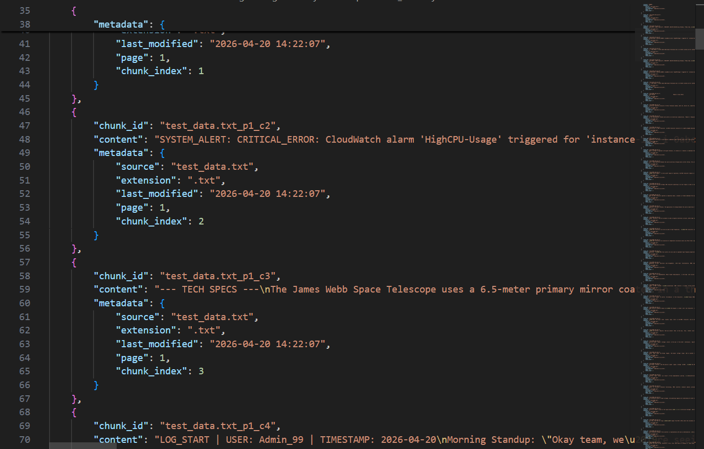
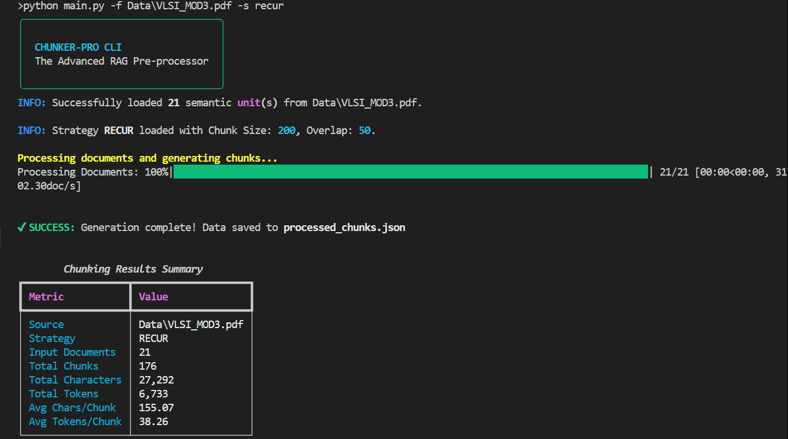
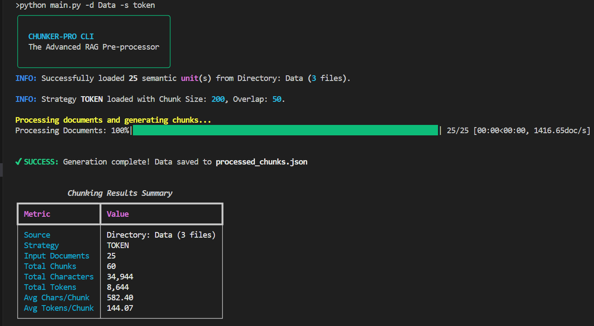

# 🏗️ CHUNKER-PRO CLI: Atomic Chunking Engine

A production-ready Command Line Interface (CLI) tool designed for **Senior AI Engineers** to transform unstructured text into high-fidelity, "Vector-DB-Ready" knowledge chunks. This engine bridges the gap between raw data and searchable embeddings by applying advanced splitting strategies with metadata preservation.

---

## 🎯 Project Objective
The quality of a RAG (Retrieval-Augmented Generation) system is directly proportional to the quality of its chunks. This tool provides an empirical way to:
*   **Implement Multiple Strategies**: Switch between character-based, token-based, and semantic splitting depending on the use case.
*   **Preserve Context**: Ensure semantic continuity using adaptive "jumps" detection.
*   **Standardize Metadata**: Inject "passports" (source, page, chunk index) into every object for downstream filtering.
*   **Validate Efficiency**: Analyze chunk density and distribution before ingestion into Vector Databases like ChromaDB or Qdrant.

---

## 🚀 Core Features

### 1. Multi-Strategy Splitting
*   **RecursiveCharacter (`recur`)**: The workhorse. Intelligently splits by a hierarchy of characters (newlines, spaces) to keep paragraphs together.
*   **Token-based (`token`)**: Cost-optimized. Splits based on LLM tokens (using OpenAI's `o200k_base` or `cl100k_base`) to maximize context window utilization.
*   **Semantic (`semantic`)**: Intelligence-first. Uses `sentence-transformers` to detect semantic shifts and split only when the topic changes, regardless of character count.

### 2. Adaptive Semantic Thresholding
Unlike static chunkers, the Semantic mode calculates the cosine distance between adjacent sentences and uses an **adaptive percentile threshold** (default 95th) to identify true topic boundaries.

### 3. Universal File Support
Seamlessly processes multiple formats:
*   📄 **Text & Markdown** (`.txt`, `.md`)
*   📑 **PDF Documents** (`.pdf`) - extracts page-level metadata.
*   📝 **Word Documents** (`.docx`) - preserves structural breaks.

### 4. Vector-DB Ready Output
Generates a `processed_chunks.json` containing structured objects with:
*   `chunk_id`: Unique identifier (Source + Page + Index).
*   `content`: The actual text chunk.
*   `metadata`: Complete lineage information for advanced RAG filtering.



---

## 🛠️ Technical Stack
*   **CLI Framework**: `argparse` with `Rich` for professional, colorful terminal UI.
*   **Chunking Logic**: `LangChain Text Splitters`.
*   **NLP & Embeddings**: `sentence-transformers` (`all-MiniLM-L6-v2`) and `scikit-learn` for semantic analysis.
*   **Tokenization**: `tiktoken` for OpenAI-aligned counting.
*   **File Parsers**: `PyPDF2` and `python-docx`.

---

## 📦 Usage

### 1. Basic Processing (Single File)
Process a single file using the recursive character strategy.
```bash
python main.py -f Data/test_data.txt --strategy recur --chunk_size 500 --chunk_overlap 50
```


### 2. Batch Processing (Directory)
Process an entire directory of mixed files using the token-based strategy.
```bash
python main.py -d ./input_folder --strategy token --chunk_size 256
```


### 3. Semantic Splitting
```bash
python main.py -f document.pdf --strategy semantic --breakpoint 90
```

---

## 📊 Terminal Summary
At the end of every run, the CLI provides a detailed execution report:
*   **Total Chunks Generated**
*   **Average Tokens per Chunk**
*   **Total Character Volume**
*   **Efficiency Metrics**

---

## 🧠 Why this matters for AI Engineers
Naive chunking (e.g., splitting every 1000 characters) often breaks sentences in half, destroying the LLM's ability to retrieve relevant context. **CHUNKER-PRO** ensures that every piece of information remains semantically coherent, significantly improving the **Faithfulness** and **Relevance** scores of RAG pipelines.
