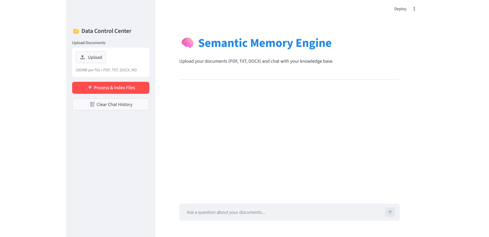
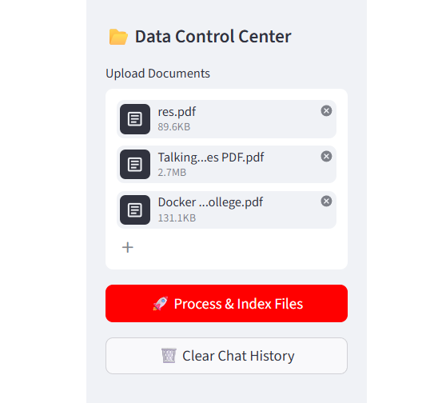
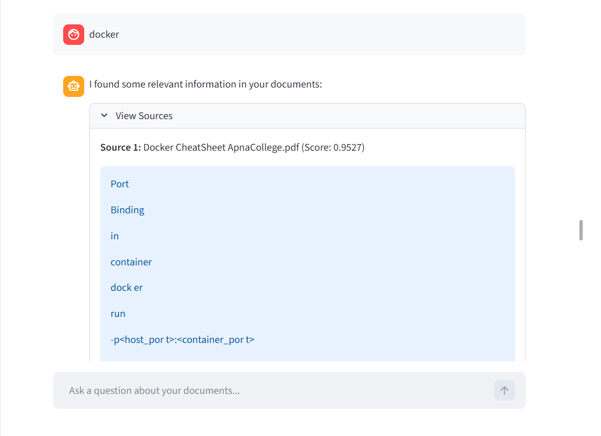
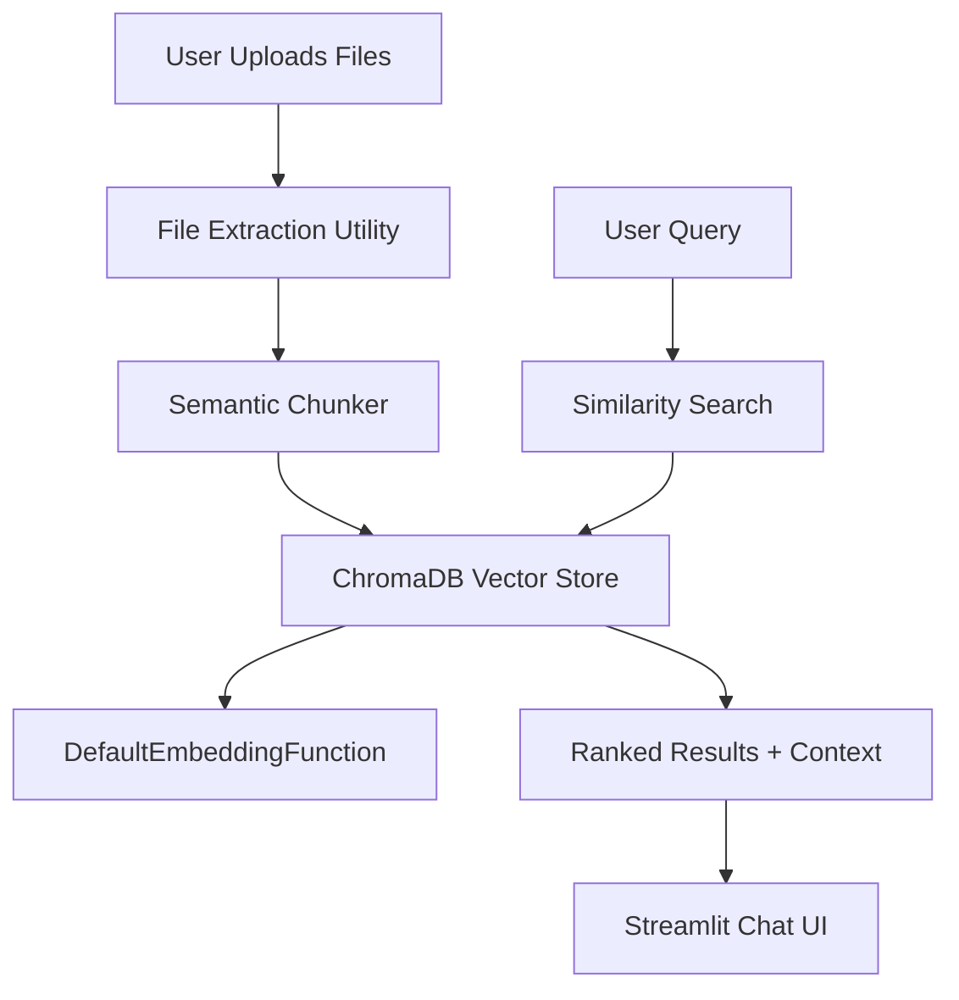

# 🧠 Semantic Memory Engine (Vector DB Mastery)

[](https://www.python.org/downloads/)
[](https://streamlit.io/)
[](https://www.trychroma.com/)

A production-grade **Retrieval-Augmented Generation (RAG)** foundation that transforms unstructured documents into a searchable, semantic knowledge base. This project demonstrates the transition from simple keyword search to advanced semantic memory.



---

## 🚀 Key Features

- **Multi-Format Extraction**: Intelligent parsing of `.pdf`, `.docx`, `.txt`, and `.md` files.
- **Adaptive Semantic Chunking**: Instead of rigid character-count splits, this engine uses sentence-level cosine similarity to find natural "semantic breaks," ensuring context remains intact.
- **Auto-Embedding Pipeline**: Integration with ChromaDB's built-in `all-MiniLM-L6-v2` model for high-performance, low-latency text vectorization.
- **Interactive Chat Interface**: A modern Streamlit UI providing a "ChatGPT-like" experience for document interrogation.
- **Metadata-Rich Retrieval**: Every search result tracks its source, page number, and similarity score for full explainability.

### 📂 Visual Walkthrough

| **Data Control Center** | **Query & Retrieval** |
|:---:|:---:|
|  |  |

---

## 🏗️ Architecture



---

## 🛠️ Technical Depth: Why Semantic Chunking?

Most basic RAG systems use **Recursive Character Splitting**, which often cuts sentences in half. This engine implements **Semantic Chunking**:
1.  Calculates embeddings for every sentence in a document.
2.  Analyzes the "distance" (cosine similarity) between consecutive sentences.
3.  Sets a breakpoint at the 95th percentile of distance "jumps."
4.  **Result**: Chunks that represent complete ideas, significantly improving retrieval accuracy.

---

## 🚦 Getting Started

### 1. Prerequisites
Ensure you have the core dependencies installed from the root:
```bash
pip install -r requirements.txt
```

### 2. Launching the App
Run the interactive Streamlit dashboard:
```bash
streamlit run streamlit_main.py
```

### 3. CLI Usage
For quick local testing:
```bash
python main.py -q "What are the core concepts of VLSI?"
```

---

## 💼 Senior AI Engineer Skills Demonstrated
- **Vector Database Lifecycle**: Initialization, indexing (Upsert), and querying.
- **Data Engineering**: Handling complex file formats and cleaning unstructured text.
- **Algorithm Design**: Implementation of adaptive thresholding for text segmentation.
- **UI/UX for AI**: Building intuitive interfaces for complex AI workflows.

---
*Developed as part of the LLM-for-AI-Engineers Mastery Track.*
