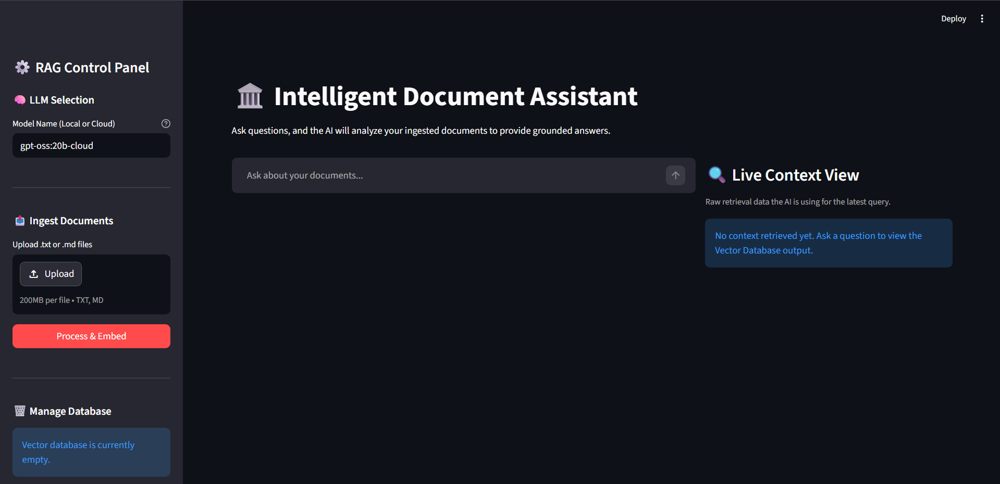
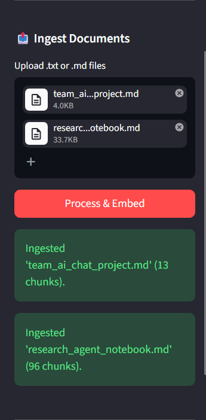
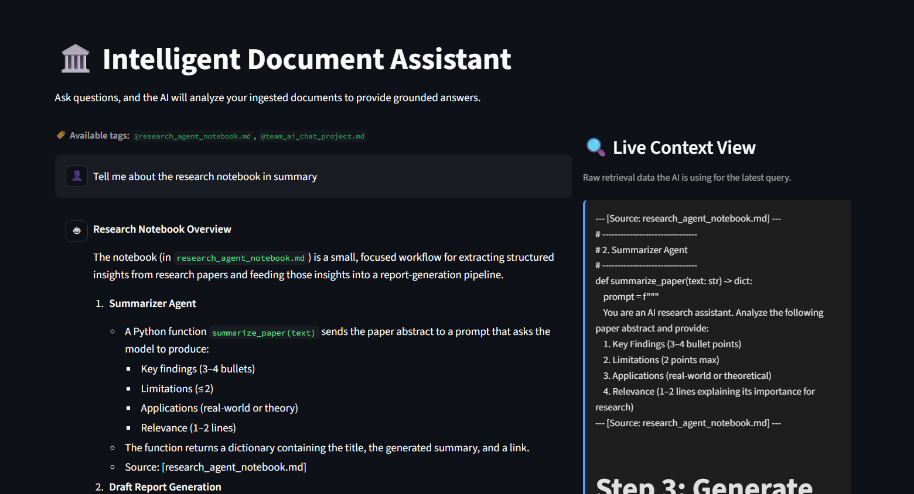
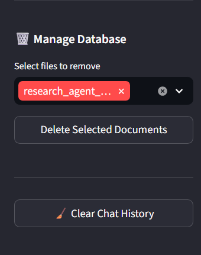

# 🧠 Local Knowledge Explorer (Naive RAG)

A production-ready Knowledge Intelligence system that transforms local text and markdown files into a searchable, persistent knowledge base. This project demonstrates the foundational **Naive RAG (Retrieval-Augmented Generation)** architecture, featuring semantic chunking, grounded LLM response logic, and a professional Streamlit interface.

---

## 🚀 Features

- **Professional Streamlit UI:** A dual-column interface featuring interactive chat and a real-time **Live Context Viewer** to inspect retrieval data.
- **Hybrid Chunking:** Combines `SemanticChunker` (meaning-based breakpoints) with `RecursiveCharacterTextSplitter` (size-constrained refinement) for optimal context delivery.
- **Persistent Vector Store:** Uses **ChromaDB** to ensure your knowledge base persists across sessions.
- **Relevance Guard:** Implements a strict distance threshold (1.2) to prevent the LLM from processing irrelevant data, reducing hallucinations and API costs.
- **High-Performance Ingestion:** Supports both high-speed asynchronous CLI ingestion and user-friendly drag-and-drop uploads via the UI.
- **Strict Grounding:** A specialized system prompt ensures the AI never uses external knowledge, citing only the provided sources.

---

## 🖥️ Visual Walkthrough

### 1. The Intelligence Center (Base UI)
The main interface provides a clean, professional workspace for interacting with your documents.


### 2. Document Ingestion
Easily upload new documents via the sidebar. The system automatically handles semantic chunking and embedding.


### 3. Smart Querying & Live Context
Ask questions and see exactly what the AI is thinking. The **Live Context View** shows the raw chunks retrieved from the database along with confidence scores.


### 4. Database Management
Maintain your knowledge base by selectively removing documents or clearing chat history.


---

## 🏗️ Architecture

1.  **Ingest:** Scans `data/` or processes uploads for `.txt` and `.md` files.
2.  **Chunk:** Split documents semantically then refine to ~500 character blocks.
3.  **Embed:** Generate vectors using `all-MiniLM-L6-v2`.
4.  **Store:** Save vectors and metadata (source name, chunk index) in ChromaDB.
5.  **Retrieve:** Query top-N chunks and filter via Distance Threshold.
6.  **Augment:** Feed filtered context into the selected LLM (via Ollama).

---

## 🛠️ Setup & Usage

### 1. Prerequisites
- Python 3.10+
- [Ollama](https://ollama.ai/) installed and running.
- Required model pulled: `ollama pull gpt-oss:20b-cloud` (or any model you prefer).

### 2. Installation
```bash
pip install -r requirements.txt
```

### 3. Running the Application

**Interactive Streamlit UI (Recommended):**
```bash
streamlit run streamlit_app.py
```

**Standard CLI Ingestion & Chat:**
```bash
python main.py -fd ./data
```

**High-Speed Async CLI Ingestion:**
```bash
python async_v_main.py -fd ./data
```

---

## 📂 Project Structure
- `streamlit_app.py`: The professional web interface.
- `main.py`: The core synchronous RAG CLI application.
- `async_v_main.py`: High-performance asynchronous CLI for batch ingestion.
- `chroma_db/`: Local directory where the persistent vector database is stored.
- `data/`: The target directory for your source documents.
- `imgs/`: Documentation assets.

---

## 🎓 Senior AI Engineer Insights

### Why Semantic + Recursive Chunking?
Standard character splitting often cuts sentences in half. Semantic splitting finds natural breaks in thought, while Recursive refinement ensures those thoughts fit within the LLM's context window without overflow.

### The Importance of Distance Thresholds
LLMs are "helpful" by nature and will try to answer even if the retrieved context is garbage. By blocking irrelevant chunks at the database level (Distance > 1.2), we ensure the model only receives high-signal information.

### Transparency is Key
In production RAG systems, users need to trust the output. Providing a **Live Context View** allows developers and users to verify the grounding of the AI's responses, making the "black box" of LLMs transparent.

---
*Created as part of the LLM-for-AI-Engineers Master Roadmap.*
