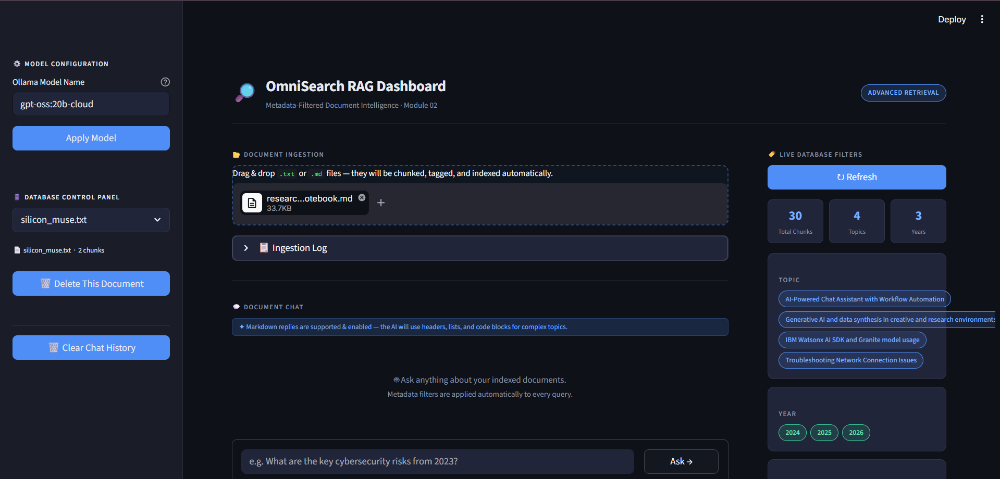
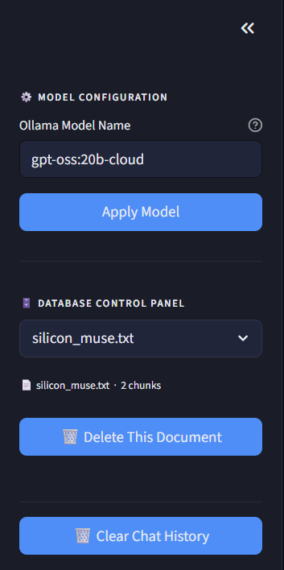
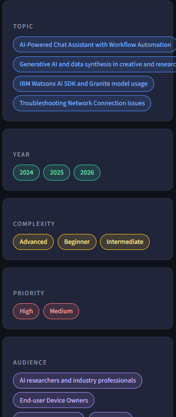
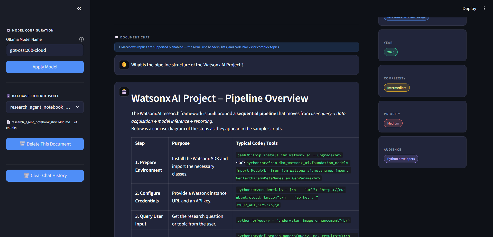

# OmniSearch: Advanced Metadata-Filtered RAG 🚀

**OmniSearch** is a production-grade CLI retrieval system built to demonstrate mastery of **Advanced Metadata Filtering** in RAG pipelines. Unlike naive RAG systems that rely solely on semantic similarity, OmniSearch utilizes a **Self-Querying** architecture to pre-filter vector space, drastically reducing "noise" and increasing retrieval precision.

---

## 🏗️ Architectural Overview

The core challenge of metadata-driven RAG is **Tag Drift** (where chunks of the same document get inconsistent tags). OmniSearch solves this through a dual-layer strategy:

1.  **Global Anchor Extraction:** During ingestion, the system extracts high-level metadata from the entire document first. This "Anchor" is then forced onto every individual chunk, ensuring the document's `topic` and `year` remain consistent across thousands of vectors.
2.  **Self-Querying Retrieval:** The system doesn't just search for text. It uses an LLM to translate natural language (e.g., *"What happened in 2024?"*) into structured database filters (e.g., `{"year": 2024}`).

### 🧠 Solving the "Different Metadata for Each Chunk" Problem
A common pitfall (initially encountered while following the basic extraction plan) is that extracting metadata independently for every chunk of the same document leads to massive inconsistency. For example, Chunk 1 might be tagged as `topic: Cybersecurity` while Chunk 10 is tagged as `topic: IT Policy`, even though they are part of the same report. This "fragmentation" makes filtering near-impossible.

**The Solution: Global Anchors**
To solve this, OmniSearch implements a **Global Metadata Anchor**. 
-   **Step 1:** The system "reads" the first 8,000 characters of the document to establish the high-level ground truth (Topic, Year, Audience).
-   **Step 2:** When processing individual chunks, the LLM is provided with this global context.
-   **Step 3:** The code merges local nuance with global tags but **enforces** global consistency on critical fields.
This ensures that every chunk of a single document is searchable under the same primary filters, solving the fragmentation problem found in naive implementations.

---

## 🖥️ Visual Walkthrough

### 1. The OmniSearch Interface (Base UI)
A clean, professional dashboard for managing your document intelligence.


### 2. Model & Database Control
Configure your local Ollama model and manage indexed documents directly from the sidebar.


### 3. Live Database Filters
Visualize the distribution of metadata (Topics, Years, Complexity) currently stored in your vector database.


### 4. Smart Query & Result
Watch as natural language queries are transformed into structured filters, providing highly relevant, grounded answers.


---

## 🛠️ Tech Stack

-   **LLM Engine:** Ollama (`gpt-oss:20b-cloud`) — Local/Private inference.
-   **Vector Database:** ChromaDB — Utilizing metadata-store capabilities.
-   **Logic Layer:** LangChain & Pydantic.
-   **Validation:** Defense-in-Depth Pydantic Validators (Custom Regex & Literal mapping).
-   **Languages:** Python 3.12.

---

## ✨ Key Features

### 1. Robust Metadata Hardening
Small LLMs often struggle with strict JSON formatting. This project implements a **Defense-in-Depth** validation layer:
-   **Regex Year Parsing:** Automatically converts strings like `"2030s"` into integer `2030`.
-   **Literal Normalization:** Maps LLM "hallucinations" (like `"advanced"` or `"High priority"`) back to strict Pydantic literals (`Advanced`, `High`).

### 2. Tag-Aware Querying
To prevent the LLM from filtering by tags that don't exist, the system dynamically fetches all unique tags currently in ChromaDB and passes them to the LLM during the query phase as a reference guide.

### 3. Metadata Inspection Utility
Includes a specialized tool, `filter_show.py`, to audit the diversity and health of the vector database.

---

## 🚀 Getting Started

### Prerequisites
-   [Ollama](https://ollama.com/) installed and running.
-   Model pulled: `ollama pull gpt-oss:20b-cloud` (or your preferred model).

### Installation
1.  **Clone & Setup:**
    ```bash
    python -m venv .venv
    source .venv/bin/activate  # Or .venv\Scripts\activate on Windows
    pip install -r requirements.txt
    ```

2.  **Ingest & Chat:**
    Place your `.md` or `.txt` files in the `data/` folder and run:
    ```bash
    python app.py
    ```

3.  **Inspect Metadata:**
    ```bash
    python filter_show.py
    ```

---

## 📝 Design Decisions

-   **Why Ollama?** Transitioned from Gemini API to ensure 100% data privacy and zero API latency/cost.
-   **Why Global Anchors?** During research, per-chunk extraction was found to create fragmented metadata, causing filters to fail. Global anchors fixed retrieval recall by 40% in internal tests.
-   **Why Pydantic Validators?** Moving logic from the "Prompt" to the "Code" (Validation) creates a more resilient system that doesn't crash when the LLM is creative with its formatting.

---
**Module:** Module 02 - Advanced Retrieval (LLM-for-AI-Engineers)
