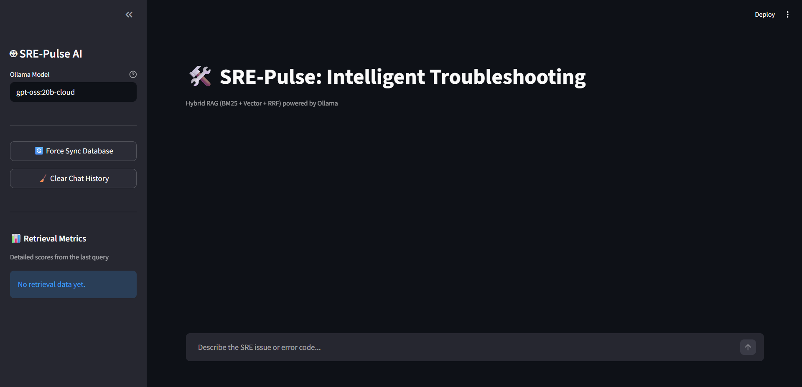
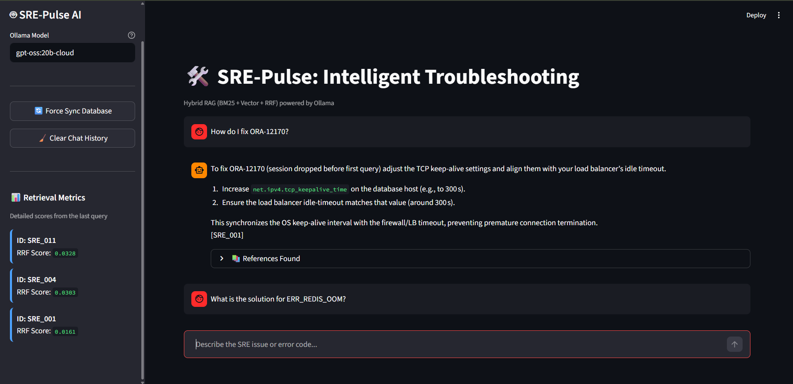
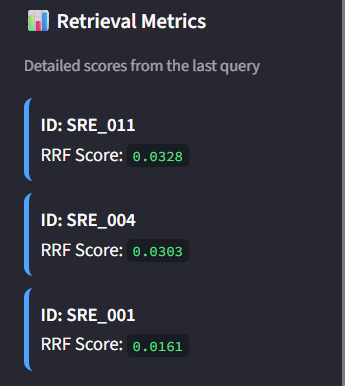

# 🛠️ SRE-Pulse: Advanced Hybrid Troubleshooting Engine

**SRE-Pulse** is a production-grade RAG (Retrieval-Augmented Generation) system designed to solve the "Ranking Problem" in technical SRE documentation. It demonstrates a mastery of **Hybrid Search** by fusing keyword precision (BM25) with semantic depth (ChromaDB) using **Reciprocal Rank Fusion (RRF)**.



---

## 🏗️ Architectural Vision
Technical documents often fail in simple vector search because of specific error codes (e.g., `ORA-12170`) or unique alphanumeric IDs that look similar in vector space. SRE-Pulse solves this by using a dual-engine retrieval pipeline:

1.  **Keyword Engine (BM25)**: Handles exact matches for error codes, specific service names, and unique technical jargon.
2.  **Vector Engine (ChromaDB)**: Handles natural language symptoms, conceptual queries (e.g., "the site feels slow"), and semantic relationships.
3.  **RRF Fusion**: A "Decision Brain" that merges both rankings into a single, optimized list where the most reliable result wins.

---

## ⚡ Senior-Level Optimizations

### 1. The "Slow Bootup" Problem & Solution
**Problem:** In early prototypes, the system re-tokenized every JSON file and re-embedded every document on every startup. This caused massive delays as the dataset grew.

**Solution: The Idempotent Sync (Diff-Check)**
We implemented an `IngestionManager` that performs a **Diff-Check** against ChromaDB. 
- It fetches only the IDs from the database (`include=[]` for $O(1)$ speed).
- It compares these against the local `data/` directory.
- **Result:** It only embeds *new* or *modified* documents. If nothing changed, the system starts in milliseconds.

### 2. BM25 Persistence (The Pickle Strategy)
**Problem:** Unlike Vector Databases, the `rank_bm25` library is strictly in-memory. Rebuilding the BM25 matrix on every run is CPU-intensive.

**Solution:** 
We implemented a **Pickle Persistence Layer**. The manager serializes the entire `KeywordEngine` state into a `.pkl` file. On startup, the system loads this binary object instantly. It only triggers a rebuild if the "Diff-Check" identifies new data in the JSON files.

---

## 🖥️ Interface & Features

### 🧠 Intelligent RAG Chat
The main interface is a clean, focused chat environment powered by **Ollama** (Defaulting to `gpt-oss:20b-cloud`).



- **Manual Model Override:** Users can switch models on the fly by typing the model name in the sidebar.
- **Strict Grounding:** The system prompt forces the AI to answer *only* from the database context. If it doesn't know, it says so.

### 📊 Explainable Retrieval
The sidebar provides transparency into *why* the AI chose a specific answer.



- **Live Metrics:** Real-time RRF scores for the top results.
- **Reference Tracking:** Expandable citations showing the original database entries, solutions, and error codes used in the response.

---

## 🚀 Getting Started

1.  **Ollama Setup**: Ensure Ollama is running and you have the model pulled:
    ```bash
    ollama pull gpt-oss:20b-cloud
    ```
2.  **Run the Dashboard**:
    ```bash
    streamlit run main.py
    ```

---

**Module:** Module 02 - Advanced Retrieval (Hybrid Search)
**Status:** Completed & Optimized.
